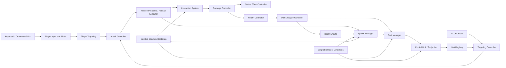

# Monsters vs Zombies - Technical Design

## 1. Purpose

This document defines the first playable technical foundation for unit movement, targeting, combat interactions, spawning, pooling, and developer testing.

The first milestone is a combat sandbox. Pressing Play in the Unity Editor must immediately start the scene. The developer must be able to move the Player, switch Player weapons, spawn every current Ally and Enemy kind, and observe units chase, attack, take damage, become stunned, divide, die, and return to pools.

This design targets the current project baseline:

- Unity `6000.5.5f1`
- Universal Render Pipeline
- Input System `1.19.0`
- AI Navigation `2.0.14`
- Unity Test Framework `1.7.0`
- 3D physics and 3D NavMesh movement

### 1.1 Goals

- Build reusable Player, Ally, and Enemy unit foundations.
- Keep health, incoming damage, attack execution, targeting, status effects, death, and movement as separate responsibilities.
- Enforce all faction interaction rules in one place.
- Support melee, projectile, area, and hitscan attacks without duplicating damage logic.
- Reuse units, projectiles, and temporary effects through pools.
- Use prefab variants for shared unit setup and nested prefabs for reusable visuals and weapons.
- Provide an immediately playable scene with keyboard and on-screen movement support.
- Provide both automated tests and fast manual test controls.
- Remain practical for many simultaneously active units.

### 1.2 Not in scope for this milestone

- A global game-state machine, menus, win or lose states, or level progression
- Save data, inventory, upgrades, economy, or unlocks
- Mobile weapon-switching UI
- Production wave spawning or encounter progression
- Network play
- Final animation, VFX, audio, UI, or balance values
- Advanced line-of-sight, cover, threat, or squad behavior

Individual units still need small local behavior states such as Idle, Chase, Attack, Stunned, and Dying. These are unit states, not a global `GameState` system.

## 2. Design Decisions and Assumptions

The following decisions remove ambiguity from the first implementation:

- `Monster` is treated as the presentation name for an Ally. Therefore, DoubleHead is implemented as an Ally. If Monster later becomes a separate gameplay faction, `UnitFaction` and the interaction matrix can be extended without replacing the combat pipeline.
- The Player automatically targets and attacks the nearest valid Enemy inside the current weapon range. This matches the current joystick-only mobile design. An optional Editor-only attack button may force an attack for timing tests, but it is not required for normal play.
- Stunner applies stun on successful damaging hits 1, 4, 7, 10, and so on. Misses, blocked interactions, and invalid targets do not advance the counter. The counter belongs to each Stunner instance and resets when the unit is taken from the pool.
- SpaceGun is a single-target hitscan laser for the first milestone. Pistol uses a bullet projectile. GrenadeGun uses a ballistic projectile with area damage.
- Dragon fireballs are single-target projectiles initially. Their impact can be extended to area damage through data later.
- MiniDivisible is a separate concrete prefab based on the Enemy base. It is not a variant of the concrete Divisible prefab because it must not inherit the divide-on-death behavior.
- ScriptableObject definitions are immutable runtime configuration. Per-spawn state such as current health, cooldowns, hit counters, current targets, and stun timers stays on runtime components.
- Scene services use explicit serialized references or initialization parameters. There will be no general service locator and no collection of unrelated singleton managers.

## 3. Architecture Overview



There are four important boundaries:

1. `AttackController` decides when an attack happens.
2. An attack executor decides how the attack reaches a target.
3. `InteractionSystem` decides whether the source may affect the target.
4. `DamageController` and `HealthController` decide what an accepted hit does to that target.

No projectile, hitbox, special unit, or AI brain is allowed to reduce health directly.

## 4. Runtime Unit Model

### 4.1 Unit identity and faction

`UnitController` is the composition root on a unit prefab. It does not implement all unit behavior. It provides the shared identity and references needed by the other components.

| Member | Purpose |
| --- | --- |
| `Definition` | The immutable `UnitDefinition` used for this spawn. |
| `Faction` | `Player`, `Ally`, or `Enemy`; copied from the definition. |
| `SpawnId` | A monotonically increasing identifier assigned on every pool spawn. |
| `IsActive` | True only while the current spawn is a valid gameplay participant. |
| Component references | Cached references to health, damage, status, targeting, attack, motor, and lifecycle components. |

`SpawnId` is important with pooling. A projectile can outlive its source, and a pooled GameObject can later represent a different unit. Attack payloads capture the source faction and source spawn ID at fire time rather than relying on a mutable pooled source reference.

`UnitFaction` has three values:

| Attacker | Valid targets |
| --- | --- |
| Player | Enemy |
| Ally | Enemy |
| Enemy | Player, Ally |

The matrix is implemented once in a pure `FactionRules` class and used by `InteractionSystem` and target selection. Physics layers reduce query cost but never determine whether damage is legal.

### 4.2 Unit component responsibilities

| Component | Owns | Must not own |
| --- | --- | --- |
| `UnitController` | Definition, faction, spawn identity, component references | Health math, AI decisions, attack timing |
| `HealthController` | Current and maximum health, alive/dead transition, health events | Faction checks, armor, stun, pooling |
| `DamageController` | The incoming damage boundary, invulnerability and future resistance hooks | Target acquisition, attack cooldowns, faction rules |
| `StatusEffectController` | Active stun and future temporary status effects | Damage delivery or health values |
| `TargetingController` | Current target, acquisition, range validation, target loss | Movement and attack execution |
| `AttackController` | Cooldown, windup, recovery, current attack sequence | Applying health changes directly |
| `UnitLifecycleController` | Spawn, active, dying, and pool-return transitions | Combat validation or spawn selection |
| `IUnitMotor` implementation | Movement, rotation, stop/resume | Target choice or attack damage |
| `AIUnitBrain` | Idle/chase/attack decisions for Ally and Enemy units | Health and interaction rules |

Components cache required sibling references during `Awake`. Missing required components are reported immediately with an actionable error that names the prefab. Runtime searches such as `FindObjectOfType` are not used for service discovery.

## 5. Health and Damage

### 5.1 HealthController

`HealthController` is the only component allowed to mutate a unit's health.

Required behavior:

- Initialize maximum and current health from `UnitDefinition` for every spawn.
- Clamp damage and healing so health remains between zero and maximum health.
- Expose read-only `CurrentHealth`, `MaximumHealth`, and `IsAlive` properties.
- Raise a health-changed event containing previous and current values.
- Raise the death event exactly once when health first reaches zero.
- Reject further health changes after death unless an explicit future revive operation is added.
- Reset all runtime state before a pooled unit becomes active again.

The numeric health rules should live in a small plain C# `HealthState` class. `HealthController` is the Unity adapter that initializes the state and publishes Unity-facing events. This makes boundary conditions easy to cover with Edit Mode NUnit tests without entering Play Mode.

`HealthController` does not disable components, play animation, spawn MiniDivisibles, or return the unit to a pool. It reports death to `UnitLifecycleController`, which coordinates that transition.

### 5.2 DamageController

`DamageController` is the target-side entry point after `InteractionSystem` accepts a hit.

Its processing order is:

1. Confirm the unit is still active and alive.
2. Reject the hit if the target is currently invulnerable.
3. Apply target-side modifiers. The first milestone has a multiplier of one, but this is the extension point for armor or resistance.
4. Pass the final positive amount to `HealthController`.
5. If the target survives, apply accepted status effects through `StatusEffectController`.
6. Return a `DamageResult` with the amount applied, whether the target died, and which effects were accepted.

Status effects apply only when the hit is accepted and the target survives. A zero-damage or invulnerable result does not stun unless a future effect explicitly declares that it bypasses damage.

The controller exposes events for presentation, such as damage numbers, hit flashes, and audio, but presentation listeners cannot change the result.

### 5.3 Hit data

Attack delivery uses immutable per-attack data rather than passing an attacker GameObject through every system.

`DamagePayload` contains:

- Source spawn ID and source faction
- Attack sequence ID
- Base damage
- Optional status-effect payloads
- Damage category for future resistance or presentation

`HitContext` adds target-specific information:

- Target `DamageController`
- Hit position and normal
- Direct-hit or area-hit flag
- Projectile or executor identifier for diagnostics

`DamageResult` and `InteractionResult` return explicit outcomes such as Applied, InvalidFaction, SourceEqualsTarget, TargetInactive, TargetDead, Invulnerable, or AlreadyHit. This supports tests and prevents silent failures.

## 6. InteractionSystem

`InteractionSystem` is a scene service responsible for combat legality and hit dispatch. It is not a general Unity physics wrapper and it does not own unit health.

### 6.1 Responsibilities

- Determine whether two factions are hostile.
- Reject self-hits by comparing the source spawn ID with the target spawn ID.
- Reject inactive, dying, pooled, or already-dead targets.
- Prevent the same area attack or melee impact from hitting one target more than once for the same attack sequence.
- Forward an accepted `HitContext` to the target `DamageController`.
- Return a detailed result to the attack executor.
- Publish a diagnostic combat event for the sandbox HUD and automated integration tests.

### 6.2 Target queries

`TargetingController`, grenades, and other area interactions use the same query rules:

- Query only the `UnitTarget` physics layer using `Physics.OverlapSphereNonAlloc` or the non-allocating equivalent available in the selected Unity version.
- A `DamageTargetProxy` on each hurtbox caches the owning `UnitController` and `DamageController`; collision code does not call repeated parent searches.
- Filter candidates through `FactionRules` and active/alive state.
- Choose nearest candidates using squared distance.
- Resolve equal-distance ties by `SpawnId` so tests are deterministic.
- Maintain a reusable buffer and record a warning in the debug HUD if the buffer fills. Increase or partition the buffer rather than allocating a new array during each query.

AI target scans are staggered across frames. A unit verifies its current target cheaply each frame but performs a full reacquisition at a configurable interval, initially around 0.2 to 0.3 seconds. The exact interval is a balance and profiling value, not a rule embedded in code.

### 6.3 Physics layers

Create these layers:

| Layer | Use |
| --- | --- |
| `World` | Ground and blocking environment geometry |
| `UnitBody` | Movement/body collision when needed |
| `UnitTarget` | Hurtbox triggers used by targeting and attacks |
| `Projectile` | Pooled projectile objects |

Faction-specific physics layers are unnecessary for the first milestone. The faction matrix remains authoritative and is easier to test than the Unity collision matrix.

## 7. Attack System

### 7.1 AttackController

Every attacking unit has one `AttackController`. It reads an `AttackDefinition` and delegates delivery to one component implementing `IAttackExecutor`.

The controller owns:

- Cooldown, windup, impact, and recovery timing
- One active attack sequence ID
- Cancellation when the attacker is stunned, dying, despawned, or loses a required target
- Facing the intended target before impact where applicable
- Sending successful-hit feedback to special hit policies such as Stunner cadence

Damage happens at the impact point, not when the animation begins. For production animation, `AttackAnimationEventRelay` calls the impact method from an animation event. Placeholder units use the same method from a configured windup timer, allowing systems to be tested before animation exists.

Melee range is checked again at impact. If the target moved out of range, the attack misses and does not deal damage.

### 7.2 Attack executors

| Executor | Used by | Delivery |
| --- | --- | --- |
| `MeleeAttackExecutor` | Classic Melee, Stunner, Divisible, MiniDivisible, DoubleHead | Builds a hit for the current target at the impact frame. |
| `ProjectileAttackExecutor` | Pistol, Classic Range, Dragon | Sends a projectile spawn request to `SpawnManager` with a captured `DamagePayload`. |
| `GrenadeAttackExecutor` | GrenadeGun | Spawns a pooled ballistic grenade. The grenade resolves one area interaction on collision or fuse expiry. |
| `HitscanAttackExecutor` | SpaceGun | Performs one ray or sphere cast, applies one target hit, and spawns a pooled beam visual. |

Projectile behavior is split by actual movement needs rather than one large component with many boolean fields:

- Bullet and fireball projectiles move kinematically and sweep between their previous and next positions to avoid tunneling.
- Grenades use a Rigidbody. Velocity and angular velocity are reset on both pool take and pool return.
- Every projectile has a maximum lifetime and returns to its pool on impact, explosion, or expiry.
- A projectile snapshots its damage payload when fired. Changing weapons or despawning the shooter does not alter a projectile already in flight.

Area attacks keep a reusable set of target spawn IDs for one explosion so multiple hurtboxes cannot cause duplicate damage.

### 7.3 Player weapons

`PlayerWeaponController` owns the ordered list:

1. Pistol
2. GrenadeGun
3. SpaceGun

It exposes the current `WeaponDefinition`, updates the Player `AttackController`, swaps the nested weapon visual, and wraps when cycling in either direction.

The current template input asset does not match the game design: `Previous` and `Next` are bound to 1 and 2, while E is assigned to `Interact`. Replace the template gameplay actions with a small purpose-built set:

| Action | Editor binding | Mobile source |
| --- | --- | --- |
| `Move` | WASD and arrow keys | `OnScreenStick` feeding a left-stick control |
| `PreviousWeapon` | Q | Not in scope yet |
| `NextWeapon` | E | Not in scope yet |
| `DebugAttack` | Left mouse or Space, optional | Not required |

The runtime input reader uses `InputActionReference` fields and does not read `Keyboard.current` directly. The on-screen stick and keyboard therefore feed the same movement action. Unused template actions such as crouch, sprint, jump, and interact should be removed from or disabled in the gameplay map so key ownership is unambiguous.

### 7.4 Special hit and death behavior

Special unit behavior is attached as focused modules:

- `StunnerHitPolicy` tracks successful damaging hits from that Stunner. Before hits 1, 4, 7, and so on, it adds a stun payload. It advances only after `InteractionSystem` reports an applied hit.
- `StatusEffectController` implements stun duration and refresh policy. The first milestone refreshes remaining duration to the larger of the current remaining time or the new stun duration. While stunned, movement, chase decisions, and attacks are blocked.
- `SpawnUnitsOnDeath` is attached only to Divisible. When the lifecycle enters Dying, it requests exactly three MiniDivisible spawns around the death position.
- MiniDivisible uses the normal Enemy AI and melee attack behavior and has no death-spawn module.

Death effects are invoked exactly once before the dead unit returns to its pool. Child spawn positions are sampled onto the NavMesh in three radial directions. A failed position is retried near the death point and reported in the sandbox diagnostics if no valid NavMesh position is found.

## 8. Targeting, AI, and Movement

### 8.1 TargetingController

`TargetingController` owns one current target and exposes target-acquired and target-lost events.

For AI units:

- Search within `ChaseRange`.
- Keep the current target while it is active, alive, hostile, and within chase range.
- Choose the nearest valid target when acquiring.
- Clear the target immediately when it dies, starts despawning, or leaves chase range.

For the Player:

- Search only within the current weapon's attack range.
- Never issue movement commands to chase a target.
- Reevaluate the search radius when the weapon changes.

Target selection does not depend on GameObject names, tags, or concrete unit kinds.

### 8.2 AIUnitBrain

Each Ally and Enemy has a small local state machine:

| State | Behavior |
| --- | --- |
| `Idle` | Stop moving and periodically search for a target. |
| `Chase` | Set a NavMesh destination near the target until it enters attack range. |
| `Attack` | Stop at effective range, face the target, and request attacks when ready. |
| `Disabled` | Used while stunned, dying, or pooled; clear the path and do not target or attack. |

Transitions follow the Game Design directly:

- No target to acquired target: Idle to Chase or Attack depending on distance.
- Target inside attack range: Chase to Attack.
- Target outside attack range but inside chase range: Attack to Chase.
- Target invalid or outside chase range: Chase or Attack to Idle.
- Stun or death: any active state to Disabled.
- Stun expiry while alive: Disabled to Idle, followed by normal reacquisition.

The attack range must be less than or equal to chase range for AI definitions. An Editor validation check reports invalid data.

### 8.3 AI movement

`NavMeshUnitMotor` wraps `NavMeshAgent` and is the only AI component that changes agent movement.

- The scene uses `NavMeshSurface` from the installed AI Navigation package.
- Destinations are refreshed at a limited frequency or after the target moves a meaningful distance, not every frame.
- `stoppingDistance` is derived from effective attack range with a small tolerance.
- `ResetPath` is called when attacking, stunned, dying, or returning to the pool.
- A pooled agent is positioned with `NavMeshAgent.Warp` after a valid NavMesh point is chosen.
- Obstacle avoidance priority is varied by spawn ID to reduce identical-agent deadlocks.

### 8.4 Player movement

`PlayerMotor` uses `CharacterController` for direct top-down movement.

- Convert the 2D move action to a world-space XZ vector relative to the camera.
- Normalize diagonal movement.
- Move with `CharacterController.Move` and apply simple gravity if the scene requires it.
- Face the movement direction while moving. During an attack, presentation may briefly face the target without changing input movement.
- Stop movement while dead or stunned.

The camera uses a simple `CameraFollowController` with a fixed top-down offset. Cinemachine is not required for this milestone.

## 9. PoolManager

`PoolManager` is a scene-level owner of pools for units, projectiles, and temporary combat visuals. It wraps Unity's `ObjectPool<T>` rather than reimplementing the storage algorithm.

### 9.1 Pool configuration

`PoolCatalog` is a ScriptableObject containing entries with:

- Stable `PoolId`
- Prefab reference
- Initial prewarm count
- Maximum retained count
- Collection-check setting for Editor and Development builds

At bootstrap, `PoolManager` validates unique IDs and required `PooledEntity` components, constructs the pools, and prewarms them. Prewarming creates inactive instances before the first combat interaction.

### 9.2 Pool contract

Every pooled root implements `IPoolable` through `PooledEntity` and any interested child components.

Spawn order:

1. Rent an inactive object from the correct pool.
2. Assign pose and spawn context while inactive.
3. Reset all runtime components through the pool-spawn contract.
4. Activate the GameObject.
5. Register an active unit with `UnitRegistry` or start projectile movement.

Return order:

1. Mark the object logically inactive so no more hits or decisions are accepted.
2. Unregister it and cancel attacks, paths, timers, and delayed callbacks.
3. Reset Rigidbody, NavMeshAgent, particles, trails, and transient presentation.
4. Deactivate the GameObject.
5. Release it to the owning pool.

`OnEnable` and `OnDisable` are not used as the sole reset mechanism because activation order alone does not provide the complete spawn context.

### 9.3 Required reset checklist

Each pooled unit must reset:

- Health and alive state
- Faction and spawn identity from the new definition
- Target and target subscriptions
- AI state and NavMesh path
- Attack cooldown, active sequence, and animation callbacks
- Stun timer and action-block state
- Stunner successful-hit count
- Divisible death-effect fired flag
- Hurtbox enabled state
- Rigidbody velocity where present
- Animator parameters and triggers
- TrailRenderer and ParticleSystem state
- External event subscriptions created for the previous spawn

The pool diagnostics expose created, inactive, active, peak-active, and failed-rent counts per pool. This is visible in the sandbox panel and makes undersized prewarm values obvious.

## 10. Spawning

### 10.1 SpawnManager

`SpawnManager` is the only service that converts a unit or projectile spawn request into a live pooled instance. It depends on `PoolManager`, the spawn catalog, and NavMesh position validation.

A `UnitSpawnRequest` contains:

- `UnitDefinition`
- Requested position and rotation
- Optional source spawn ID, used by Divisible diagnostics
- Spawn reason: Initial, Debug, DeathEffect, or future Gameplay

The service resolves the pool, validates or samples the location, assigns a new `SpawnId`, initializes the instance, and returns a typed result. It reports a failure instead of silently instantiating an unpooled fallback.

### 10.2 Concrete spawners

| Spawner | Purpose |
| --- | --- |
| `InitialSandboxSpawner` | Spawns the Player and optional initial test units during `Start`. |
| `DebugUnitSpawner` | Handles keyboard and sandbox-panel spawn requests. |
| `SpawnUnitsOnDeath` | Requests three MiniDivisibles from a Divisible death position. |
| `SpawnPointGroup` | Provides deterministic or round-robin positions for Player, Ally, and Enemy test spawns. |

A production `WaveSpawner` is deliberately deferred. Its future implementation should create the same `UnitSpawnRequest` objects and should not bypass `SpawnManager`.

### 10.3 Sandbox spawn controls

The combat sandbox provides both Game view buttons and keyboard shortcuts. The runtime panel is more useful than Inspector-only buttons because the developer can keep focus on the Game view while units are fighting.

Default shortcuts:

| Key | Action |
| --- | --- |
| F1 | Show or hide the combat sandbox panel |
| 1 | Spawn Enemy Classic Melee |
| 2 | Spawn Enemy Classic Range |
| 3 | Spawn Enemy Dragon |
| 4 | Spawn Stunner |
| 5 | Spawn Divisible |
| 6 | Spawn Ally Classic Melee |
| 7 | Spawn Ally Classic Range |
| 8 | Spawn Ally Dragon |
| 9 | Spawn Ally DoubleHead |
| Backspace | Return all non-Player units and active projectiles to their pools |
| Q / E | Previous / next Player weapon |

The panel includes one button per concrete unit, Spawn 10 variants for load testing, clear non-Player units, reset Player, pause AI decisions, draw ranges, and show pool counts. Debug keys live in a separate `SandboxDebug` input action map and the debug panel is enabled only in the Editor or Development builds.

Enemy and Ally keyboard spawns use separate named `SpawnPointGroup` objects so results are repeatable. The panel may additionally offer Spawn At Cursor by raycasting from the camera onto the World layer.

## 11. Managers and Scene Lifetime

Only systems with a clear collection or scene-lifetime responsibility are managers.

| Scene service | Responsibility |
| --- | --- |
| `CombatSandboxBootstrap` | Validate references, initialize services in order, and start the sandbox. |
| `PoolManager` | Own and report all runtime object pools. |
| `SpawnManager` | Resolve spawn requests and initialize pooled instances. |
| `InteractionSystem` | Validate and dispatch combat interactions. |
| `UnitRegistry` | Track currently active units by faction and spawn ID for lifecycle, diagnostics, and deterministic test access. |

Do not create a general `GameManager`, `UnitManager`, `CombatManager`, or `DataManager` that accumulates unrelated behavior. Presentation systems subscribe to events rather than being called from health or damage code.

### 11.1 Initialization order

`CombatSandboxBootstrap` is a scene object with explicit references. It performs this sequence:

1. Validate catalogs, definitions, layers, and scene references.
2. Initialize and prewarm `PoolManager`.
3. Initialize `UnitRegistry`, `InteractionSystem`, and `SpawnManager`.
4. Enable gameplay and debug input maps.
5. Ask `InitialSandboxSpawner` to spawn the Player and configured starting units.
6. Bind the camera and sandbox HUD to the spawned Player.

The sequence runs directly from `Awake` and `Start`. There is no loading state and no global GameState gate. If a required reference is missing, bootstrap disables the sandbox and prints one consolidated error rather than allowing partial initialization.

### 11.2 UnitRegistry

`UnitRegistry` updates only on spawn activation and logical deactivation. It provides:

- Active units grouped by faction
- Lookup by current spawn ID
- Unit-spawned and unit-removed events
- Counts for the debug HUD and tests
- A safe snapshot API for developer tooling

The registry does not update units or decide targets. Target queries use physics for spatial filtering and the registry for identity, diagnostics, and direct test lookup.

## 12. ScriptableObject Data

Use separate assets for reusable configuration and keep behavior in runtime components.

### 12.1 UnitDefinition

Suggested fields:

- Stable unit ID and display name
- `UnitFaction`
- Maximum health
- Move speed and turn speed
- Chase range; zero for the Player
- Default `AttackDefinition`; Player receives its current attack from the equipped weapon
- Stun duration or effect definition when relevant
- Concrete pool ID or spawn-catalog key
- Optional presentation references such as health-bar style

Create distinct assets for Ally and Enemy versions of shared kinds because faction, health, speed, and balance can differ.

### 12.2 AttackDefinition

Suggested fields:

- Damage
- Attack range
- Cooldown, windup, and recovery durations
- Attack executor type or compatible executor configuration
- Projectile definition where needed
- Animation trigger or attack presentation ID
- Impact radius for area attacks

### 12.3 WeaponDefinition

Suggested fields:

- Weapon ID and display name
- `AttackDefinition`
- Nested weapon visual prefab
- Muzzle socket name or typed socket ID
- Optional fire and impact presentation IDs

### 12.4 ProjectileDefinition

Suggested fields:

- Projectile pool ID
- Speed and maximum lifetime
- Collision radius
- Gravity or launch parameters where relevant
- Explosion radius and fuse for grenades
- World-collision behavior

### 12.5 Catalogs and validation

- `UnitCatalog`: maps stable unit IDs to definitions for the debug panel and future gameplay systems.
- `PoolCatalog`: maps pool IDs to prefabs and capacity settings.
- `SandboxSpawnConfiguration`: Player definition, optional initial units, and default spawn counts.

Custom `OnValidate` checks and an Editor validation command must report:

- Duplicate IDs
- Missing prefabs or pool entries
- Non-positive health, damage, ranges, or lifetimes
- AI attack range greater than chase range
- A projectile attack without a projectile definition
- Prefabs missing required unit, target, or pool components
- Divisible pointing to anything other than the MiniDivisible definition
- MiniDivisible containing a divide-on-death component

## 13. Prefab Structure

Prefab inheritance provides defaults; concrete gameplay values still come from definitions.

### 13.1 Unit prefab variant tree

```text
PF_Unit_Base
|-- PF_Unit_Player_Base
|   `-- PF_Player
`-- PF_Unit_AI_Base
    |-- PF_Unit_Ally_Base
    |   |-- PF_Ally_ClassicMelee
    |   |-- PF_Ally_ClassicRange
    |   |-- PF_Ally_Dragon
    |   `-- PF_Ally_DoubleHead
    `-- PF_Unit_Enemy_Base
        |-- PF_Enemy_ClassicMelee
        |-- PF_Enemy_ClassicRange
        |-- PF_Enemy_Dragon
        |-- PF_Enemy_Stunner
        |-- PF_Enemy_Divisible
        `-- PF_Enemy_MiniDivisible
```

`PF_Unit_Base` contains:

```text
PF_Unit_Base
|-- UnitController
|-- HealthController
|-- DamageController
|-- StatusEffectController
|-- TargetingController
|-- AttackController
|-- UnitLifecycleController
|-- PooledEntity
|-- Hurtbox                         [UnitTarget layer]
|   |-- Trigger Collider
|   `-- DamageTargetProxy
|-- VisualRoot
|   `-- Model                       [nested visual prefab in concrete variants]
|-- Sockets
|   |-- AttackOrigin
|   |-- WeaponSocket
|   |-- RightHandSocket
|   `-- MouthSocket
|-- UIAnchor
`-- DebugVisuals                    [Editor/Development only]
```

`PF_Unit_Player_Base` adds `CharacterController`, `PlayerInputReader`, `PlayerMotor`, `PlayerWeaponController`, and Player auto-target/attack behavior.

`PF_Unit_AI_Base` adds `NavMeshAgent`, `NavMeshUnitMotor`, and `AIUnitBrain`.

Faction base variants set the expected definition type, faction-colored debug visuals, and faction presentation defaults. Concrete variants assign their `UnitDefinition`, model, attack executor, sockets, and special behavior modules.

### 13.2 Reuse through nested prefabs

Use nested prefabs where visual or attack content is shared across variants:

- Dragon model and mouth socket shared by Ally and Enemy Dragon variants
- Pistol, GrenadeGun, SpaceGun weapon visuals
- Bullet, grenade, fireball, laser beam, hit effect, and explosion prefabs
- Divisible model shared with MiniDivisible; MiniDivisible overrides scale and does not inherit Divisible behavior
- Common world-space health bar

Do not put faction or damage rules into visual nested prefabs.

### 13.3 Prefab override rules

- Base prefabs own required component wiring and child names.
- Concrete variants may override definition, visuals, collider dimensions, animation controller, executor, and sockets.
- Concrete variants must not remove required base components.
- Unit stats are not copied into many prefab fields; the `UnitDefinition` remains the source of balance values.
- Variant-specific additions such as `StunnerHitPolicy` and `SpawnUnitsOnDeath` are visible on the concrete root.

## 14. Combat Sandbox Scene

Create `Assets/Scenes/CombatSandbox.unity`. Keep `SampleScene` unchanged until the sandbox is verified, then decide whether to replace or remove it.

Suggested hierarchy:

```text
CombatSandbox
|-- __Systems
|   |-- CombatSandboxBootstrap
|   |-- PoolManager
|   |-- SpawnManager
|   |-- InteractionSystem
|   |-- UnitRegistry
|   `-- DebugUnitSpawner
|-- Environment
|   |-- Ground
|   |-- Obstacles
|   `-- NavMeshSurface
|-- SpawnPoints
|   |-- PlayerSpawn
|   |-- AllySpawnPoints
|   `-- EnemySpawnPoints
|-- CameraRig
|   `-- MainCamera
|-- UI
|   |-- GameplayCanvas
|   |   |-- OnScreenStick
|   |   |-- PlayerHealth
|   |   `-- CurrentWeapon
|   |-- CombatSandboxPanel
|   `-- EventSystem
`-- Lighting
```

The sandbox panel displays:

- Player health and current weapon
- Active Player, Ally, and Enemy counts
- Active and inactive pool counts
- Selected or hovered unit faction, health, AI state, and current target
- Last interaction result
- Toggles for chase range, attack range, target line, and spawn points

Gizmos use consistent colors: chase range in yellow, attack range in red, current target link in cyan, Ally identity in blue, and Enemy identity in magenta. Gizmos are not present in release builds.

## 15. Main Runtime Flows

### 15.1 AI melee attack

1. `TargetingController` finds the nearest hostile unit in chase range.
2. `AIUnitBrain` tells `NavMeshUnitMotor` to chase.
3. At attack range, the brain stops the motor and requests an attack.
4. `AttackController` starts windup and creates an attack sequence ID.
5. At the impact event, `MeleeAttackExecutor` rechecks range and creates a hit.
6. `InteractionSystem` validates source, target, faction, and duplicate-hit rules.
7. `DamageController` applies damage and optional effects.
8. `HealthController` reports health change or death.

### 15.2 Ranged attack

1. Targeting and attack timing are the same as melee.
2. `ProjectileAttackExecutor` snapshots a `DamagePayload` and asks `SpawnManager` for a projectile; `SpawnManager` rents it from `PoolManager`.
3. The projectile moves independently of its source.
4. A target collision is converted to `HitContext` through `DamageTargetProxy`.
5. `InteractionSystem` resolves the hit.
6. The projectile returns to its pool on impact or lifetime expiry.

### 15.3 Death and pooling

1. `HealthController` reaches zero and raises death exactly once.
2. `UnitLifecycleController` marks the spawn Dying and makes it non-targetable.
3. Target, movement, attack, and status processing stop.
4. Death-effect modules execute. Divisible requests three MiniDivisible spawns here.
5. Presentation plays for a configured delay, or immediately completes for placeholder units.
6. `UnitLifecycleController` returns the unit through `PoolManager`.
7. Any other unit targeting the dead spawn receives target invalidation and reacquires normally.

### 15.4 Stun

1. A Stunner hit policy marks the correct successful-hit attempt with a stun payload.
2. The normal interaction and damage pipeline accepts or rejects the hit.
3. On acceptance, `StatusEffectController` starts or refreshes stun.
4. AI brain, Player motor, and `AttackController` observe blocked action properties and stop.
5. On expiry, actions become available. A living AI returns to Idle and reacquires; the Player responds to current input again.

## 16. Code and Asset Layout

Use the existing `Assets/Scripts` root and expand it as follows:

```text
Assets
|-- Scripts
|   |-- Runtime
|   |   |-- Core
|   |   |   |-- Bootstrap
|   |   |   |-- Pooling
|   |   |   `-- Time
|   |   |-- Data
|   |   |-- Units
|   |   |   |-- AI
|   |   |   |-- Player
|   |   |   |-- Movement
|   |   |   `-- Lifecycle
|   |   |-- Combat
|   |   |   |-- Health
|   |   |   |-- Damage
|   |   |   |-- Interaction
|   |   |   |-- Attacks
|   |   |   |-- Projectiles
|   |   |   `-- StatusEffects
|   |   |-- Spawning
|   |   |-- Input
|   |   `-- UI
|   |-- Editor
|   |   |-- Validation
|   |   `-- Sandbox
|   `-- Tests
|       |-- EditMode
|       `-- PlayMode
|-- Data
|   |-- Units
|   |-- Attacks
|   |-- Weapons
|   |-- Projectiles
|   `-- Catalogs
|-- Prefabs
|   |-- Units
|   |-- Weapons
|   |-- Projectiles
|   |-- Effects
|   `-- UI
`-- Scenes
    `-- CombatSandbox.unity
```

Start with one `MonstersVsZombies.Runtime.asmdef` for runtime code. Add `MonstersVsZombies.Editor.asmdef`, `MonstersVsZombies.Tests.EditMode.asmdef`, and `MonstersVsZombies.Tests.PlayMode.asmdef`, each referencing Runtime as needed. One runtime assembly keeps the first milestone easy to change; split runtime assemblies only after dependency or compile-time costs justify it.

Use namespaces rooted at `MonstersVsZombies`, followed by the folder responsibility, such as `MonstersVsZombies.Combat` and `MonstersVsZombies.Spawning`. All implementation must follow `Docs/CodeNameConventions.md` and `Docs/CodingPreferences.md`.

## 17. Testing Strategy

Testing is divided into fast rules tests, Play Mode integration tests, manual sandbox scenarios, and performance checks.

### 17.1 Edit Mode tests

Use NUnit `[Test]` tests for deterministic code that does not need frame updates.

Minimum test set:

| Test group | Cases |
| --- | --- |
| `FactionRulesTests` | All nine attacker/target faction combinations; self-hit rejection is separate. |
| `HealthStateTests` | Initialization, clamp at zero/max, exact-zero death, overkill, death only once, reset after death. |
| `DamageRulesTests` | Inactive/dead rejection, invulnerability, zero or negative damage, accepted result data. |
| `WeaponCycleTests` | Previous/next wrapping and single-item behavior. |
| `StunnerHitPolicyTests` | Stun on 1, 4, 7; no advancement on miss or rejected hit; reset on respawn. |
| `TargetSelectionTests` | Nearest valid target, invalid faction, dead target, range boundary, deterministic equal-distance tie. |
| `AttackSequenceTests` | One target hit once per sequence and allowed again by a new sequence. |
| `SpawnFormationTests` | Exactly three distinct MiniDivisible offsets around the death point. |
| `CatalogValidationTests` | Duplicate and missing pool/unit IDs and incompatible definitions. |

Prefer plain `[Test]` over `[UnityTest]` unless the assertion requires frames or coroutines.

### 17.2 Play Mode integration tests

Play Mode tests instantiate a small fixture or load a lightweight test scene.

Minimum integration set:

1. Spawn an Enemy and Ally, allow one attack, and verify only the hostile target loses health.
2. Place a friendly unit inside an attack area and verify friendly fire is rejected.
3. Verify an AI starts chasing inside chase range, attacks inside attack range, resumes chase when the target leaves attack range, and clears the target outside chase range.
4. Stun a moving AI, verify its path and attack stop, wait for expiry, and verify behavior resumes.
5. Kill Divisible and verify exactly three active MiniDivisibles and one returned Divisible.
6. Despawn and respawn the same pooled Stunner instance; verify full health, no target, no stun, and a reset hit counter.
7. Fire each projectile type; verify impact or expiry returns it to the correct pool.
8. Fire a grenade at a target with multiple hurtboxes and verify only one damage application.
9. Kill a unit while a projectile from it is in flight and verify the captured payload resolves without reading recycled source state.
10. Switch Player weapons through Q and E and verify Pistol, GrenadeGun, and SpaceGun wrap correctly.

Tests should wait on observable events or explicit conditions with a timeout. Avoid fixed multi-second waits that make failures slow and unreliable.

### 17.3 Manual test checklist

Before a feature is considered complete, run the sandbox and verify:

- Pressing Play immediately spawns a controllable Player.
- WASD, arrow keys, and the on-screen stick move in the same world directions.
- Q and E cycle all three weapons and update the visible weapon and HUD.
- Every shortcut and panel button spawns the expected concrete prefab at a valid point.
- Player and Allies attack Enemies, Enemies attack Player and Allies, and friendly pairs never damage each other.
- Melee units close distance; ranged units stop farther away.
- AI crosses the chase and attack boundaries correctly in both directions.
- Pistol bullet, grenade area damage, SpaceGun laser, and Dragon fireball each use the common interaction pipeline.
- Stunner stuns on hits 1, 4, and 7 and the target fully stops acting for the stun duration.
- Divisible creates exactly three independently acting MiniDivisibles on death.
- Dead units cannot move, target, attack, receive repeat death, or remain in target lists.
- Clearing and respawning units shows no stale health, target, cooldown, stun, animation, or hit-count state.
- Range gizmos and the debug HUD agree with observed behavior.
- Console has no exceptions and no repeated warnings during normal combat.

### 17.4 Stress and profiling checks

Create panel presets for 10 versus 10, 50 versus 50, and 100 versus 100. These are diagnostic loads, not promised mobile capacity until measured on a target device.

For each preset:

- Prewarm pools, then capture CPU, memory, physics, rendering, and NavMesh behavior with the Unity Profiler.
- Confirm steady combat has no recurring managed allocations from targeting, attacks, projectiles, or pool lifecycle.
- Confirm the prewarmed scenario does not repeatedly call Instantiate or Destroy.
- Watch target-query buffer saturation, pool growth, peak projectile count, and agent path-update cost.
- Repeat a representative build on the intended mobile device before setting an official unit-count or frame-time budget.

Automated performance tests can be added after the first profiler baseline identifies stable, meaningful measurements. Functional tests should not assert frame rate.

## 18. Implementation Order

Each phase ends with a playable or testable slice.

### Phase 1: Project structure and pure rules

- Add runtime, Editor, and test assembly definitions.
- Add faction, health state, damage payload/result, and spawn identity types.
- Implement and test `FactionRules`, `HealthState`, weapon cycling, and Stunner cadence.
- Create data definitions and validation rules.

Exit condition: Edit Mode rules tests pass and representative definition assets validate.

### Phase 2: Common unit, pooling, and spawning

- Build `PF_Unit_Base`, `UnitController`, health, damage, lifecycle, and status components.
- Implement `PoolManager`, `PoolCatalog`, `SpawnManager`, `UnitRegistry`, and pool lifecycle contracts.
- Build the sandbox scene, NavMesh, spawn points, bootstrap, and initial Player spawn.
- Add pool reset integration tests.

Exit condition: pressing Play spawns a reusable unit, damage can kill it, and respawn produces clean state.

### Phase 3: Player movement and basic combat

- Replace template input actions with the purpose-built maps.
- Implement Player movement, camera follow, auto-targeting, attack timing, and Q/E weapon switching.
- Implement melee, bullet, grenade, and hitscan executors and their projectile pools.
- Add the basic debug panel and shortcuts.

Exit condition: the Player moves and can use all three weapons against spawned stationary Enemy targets.

### Phase 4: Ally and Enemy AI

- Build AI prefab and faction base variants.
- Implement target scanning, NavMesh motor, and AI local states.
- Create Classic Melee, Classic Range, Dragon, and DoubleHead definitions and prefabs.
- Add chase/attack boundary Play Mode tests.

Exit condition: mixed Allies and Enemies find only valid targets, chase, attack, and retarget after death.

### Phase 5: Special units

- Build Stunner, stun status behavior, and hammer presentation hooks.
- Build Divisible, MiniDivisible, and the three-unit death spawn.
- Add their Edit Mode and Play Mode tests.

Exit condition: stun cadence and divide-on-death pass automated and manual checks across pool reuse.

### Phase 6: Diagnostics and performance baseline

- Complete HUD, gizmos, Spawn 10 controls, clear/reset controls, and pool metrics.
- Add all concrete prefab validation.
- Run 10v10, 50v50, and 100v100 profiles and tune scan/path frequencies and pool prewarm values.
- Run the full manual checklist and automated suites.

Exit condition: the acceptance criteria below are met with no known state-reset or interaction-rule defects.

## 19. Acceptance Criteria

The first unit and interaction milestone is complete when:

- `CombatSandbox.unity` begins play without a menu or global GameState.
- A Player spawns automatically and moves with keyboard and the on-screen stick.
- Q and E cycle Pistol, GrenadeGun, and SpaceGun in both directions.
- Developer keys and Game view buttons spawn every current Ally and Enemy kind.
- Ally/Player-versus-Enemy interaction rules are correct for melee, projectile, area, and hitscan delivery.
- Health clamps correctly, death fires once, and dead units stop all actions.
- AI chase and attack range transitions match the Game Design.
- Stunner prevents movement, chasing, and attacking on hits 1, 4, 7, and so on, then releases the target after the duration.
- Divisible death creates exactly three independently active MiniDivisibles.
- Units and projectiles return to pools and are fully reset when reused.
- The required Edit Mode and Play Mode tests pass.
- A 50-versus-50 sandbox profile has been captured and any recurring managed allocations or obvious unbounded pool/query growth have been addressed before choosing production capacity targets.

## 20. Unity References

- [Unity AI Navigation manual](https://docs.unity3d.com/6000.0/Documentation/Manual/com.unity.ai.navigation.html)
- [Unity ObjectPool API](https://docs.unity3d.com/6000.0/Documentation/ScriptReference/Pool.ObjectPool_1.html)
- [Unity Test Framework manual](https://docs.unity3d.com/Manual/com.unity.test-framework.html)
- [Input System on-screen controls](https://docs.unity3d.com/Packages/com.unity.inputsystem@1.19/manual/OnScreen.html)
